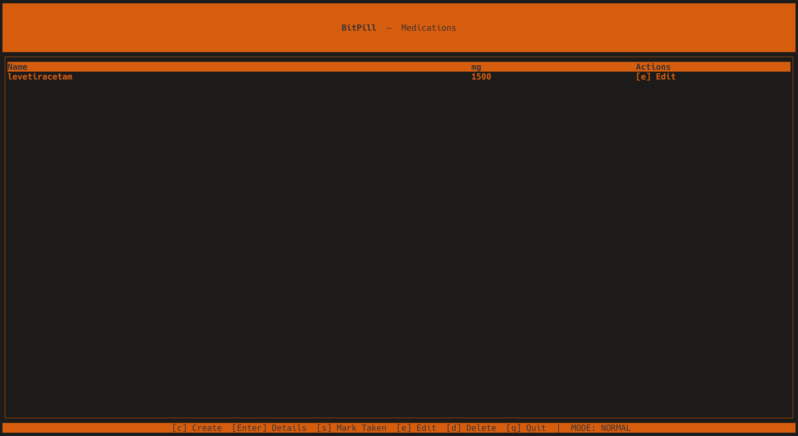

# BitPill

> **Work in progress.** A personal medication management application built in Rust.

BitPill helps individuals manage their daily medications — tracking pills, dosages, and schedules in one place.

It is being built with a focus on reliability and correctness, because when it comes to medication, errors matter.

---

## Why did I build this?

I built BitPill to solve a personal problem: managing my complex medication regimen for a chronic condition.

This was developed because my medications are expensive and if I don't take them correctly, I risk my health and waste money.

I can have convulsions if I miss doses, so I need a reliable way to track when to take each medication and ensure I dont forget.

By building my own, I can tailor it exactly to my needs and ensure it works correctly.

---

## Prerequisites

- [Rust](https://rustup.rs/) (edition 2024, stable toolchain)
- [just](https://github.com/casey/just) — task runner (`cargo install just` or via your package manager)

### Observation

BitPill is designed to be simple to run locally without a lot of external dependencies.

It uses **JSON** as the storage format and keeps data in memory for simplicity.

This means there are no database setup steps required.

If you have `Rust` and `just` installed you can install all dependency tools with `just tools`.

---

## Starting the application

BitPill ships a TUI built with [ratatui](https://ratatui.rs).

A REST API is in WIP state but it’s built with [actix-web](https://actix.rs/).

By default `just run` starts it on **port 8080** and also launches the TUI in the foreground.

You can choose to run just one of them if you prefer:

```bash
just run-api     # REST server only  (http://localhost:8080)
just run-tui     # Terminal UI only
```

## Terminal UI (TUI)

BitPill ships a TUI built with [ratatui](https://ratatui.rs).



This project was intended to be a terminal application from the start, so the TUI is the primary interface and the REST API is a secondary delivery adapter that still needs work.

To launch it instead of the REST server, replace `main.rs` with:

### TUI keyboard shortcuts

#### VIM Modes

The TUI uses a VIM-like modal interface with two main modes:

- **Normal mode** for navigation.
- **Insert mode** for typing into form fields.

When you first open the app, you start in Normal mode. Press `i` to enter Insert mode when a form field is selected, and `Esc` to return to Normal mode.

##### Normal mode

| Screen | Key | Action |
|--------|-----|--------|
| Medication list | `c` | Open the create-medication form |
| Medication list | `j` / `↓` | Move selection down |
| Medication list | `k` / `↑` | Move selection up |
| Medication list | `q` | Quit |
| Medication list | `Enter` or `v` | Open medication details for selected item |
| Medication details | `s` | Open Mark-as-taken selection for today's slots/records |
| Create form | `Tab` | Cycle between fields (Name → Amount → Times) |
| Create form | `Enter` | Submit the form |
| Create form | `Esc` | Cancel and go back |
| Schedule result | any key | Dismiss and go back |

Pressing use `h`, `j`, `k` or `l`, to navigate between fields, and `Enter` will submit the form.

##### Insert mode

You have to be in insert mode to type into form fields.

Press `i` to enter insert mode when a form field is selected, and `Esc` to exit back to normal mode.

### Validation and modals

- Input validation errors (e.g., invalid amount or malformed time slots) are shown in a modal over the current screen. The background is dimmed to focus the modal; press Esc or Enter (or any key) to dismiss and return to the form.
- Shortcuts are contextual: actions such as "mark as taken" are only available on screens that support them (for example, `s` for marking doses is only active inside the Medication Details screen).

### REST API

**Status: WIP** — The REST API is under development and not yet ready for production use.

---

## Development

### Running tests

```bash
just test        # full suite with coverage (cargo llvm-cov)
```

### Default recipe (CI-equivalent)

Runs formatting check, lint, and tests with coverage in one command:

```bash
just
```

### All tasks

```bash
just build       # cargo build
just run         # REST server (http://localhost:8080)
just run-tui     # Terminal UI
just run-api     # REST server (background) + TUI (foreground)
just test        # tests + coverage report
just lint        # cargo clippy -- -D warnings
just fmt         # cargo fmt
just fmt-check   # formatting check only
just lint-workflows  # validate .forgejo/workflows/*.yml with actionlint
just clean       # cargo clean
just tools       # install rustfmt, clippy, cargo-llvm-cov
```

---

## Architecture

BitPill follows **Hexagonal Architecture** (Ports & Adapters). Dependencies always point inward — outer layers know about inner layers, never the reverse.

```
┌──────────────────────────────────────────┐
│            Presentation Layer            │
│            (TUI)                         │
├──────────────────────────────────────────┤
│          Infrastructure Layer            │
│   (Persistence, Clock, Notifications)    │
├──────────────────────────────────────────┤
│           Application Layer              │
│        (Use-Case Services, Ports)        │
├──────────────────────────────────────────┤
│              Domain Layer                │
│        (Entities, Value Objects)         │
└──────────────────────────────────────────┘
         ↑ Dependencies point inward ↑
```

### Layer responsibilities

| Layer | Responsibility |
|---|---|
| **Domain** | Core business rules — `Medication`, `DoseRecord`, `Dosage`, `ScheduledTime`, etc. Zero external dependencies; pure logic only. |
| **Application** | Use-case services (`CreateMedicationService`, `MarkDoseTakenService`, `ScheduleDoseService`, `ListAllMedicationsService`). Defines port traits that infrastructure implements. |
| **Infrastructure** | Concrete adapters: `InMemoryMedicationRepository`, `InMemoryDoseRecordRepository`, `SystemClock`, `ConsoleNotificationAdapter`. Wired together in `container.rs`. |
| **Presentation** | Delivery adapters — `tui/` (ratatui terminal UI, **WIP**: `rest/` actix-web HTTP API) |

### Module layout

```
src/
├── domain/
│   ├── entities/          # Medication, DoseRecord
│   └── value_objects/     # Dosage, MedicationId, ScheduledTime, TakenAt, …
├── application/
│   ├── ports/             # Trait definitions + fakes/ (test doubles)
│   └── services/          # Use-case implementations
├── infrastructure/
│   ├── clock/             # SystemClock, SystemScheduledTimeSupplier
│   ├── notifications/     # ConsoleNotificationAdapter
│   ├── persistence/       # InMemoryMedicationRepository, InMemoryDoseRecordRepository
│   └── container.rs       # Composition root
└── presentation/
    ├── rest/              # actix-web server + handlers (WIP)
    └── tui/               # ratatui app + screens + event handling
```

### Dependency rule

| Allowed | Forbidden |
|---|---|
| `presentation` → `application` ✅ | `domain` → anything outer ❌ |
| `presentation` → `domain` ✅ | `application` → `infrastructure` ❌ |
| `infrastructure` → `application` ✅ | `application` → `presentation` ❌ |
| `application` → `domain` ✅ | `infrastructure` → `presentation` ❌ |

---

## Contributing

### Software structure

```
src/application/
├── dtos/
│   ├── requests.rs    # All request DTOs (one file)
│   └── responses.rs   # All response DTOs (one file)
├── ports/
│   ├── inbound/       # Port traits (one per file)
│   ├── outbound/      # Repository/trait ports
│   └── fakes/         # Test doubles
└── services/          # Use-case implementations
```

### Adding a new use case

1. **Add DTOs** — add `Request` and `Response` structs to `dtos/requests.rs` and `dtos/responses.rs`.
2. **Define the port** — create `src/application/ports/my_action_port.rs` with a trait.
3. **Implement the service** — create `src/application/services/my_action_service.rs`. No I/O allowed.
4. **Add a fake** — create test doubles in `src/application/ports/fakes/`.
5. **Wire the container** — add concrete adapters in `src/infrastructure/`, then wire in `container.rs`.
6. **Expose in presentation** — add a TUI handler (REST is WIP).

### Code conventions

- **One primary type per file** — filename matches the type.
- **DTOs in one file** — all requests in `requests.rs`, all responses in `responses.rs`.
- **Imports grouped at file top** — use the `crate::application::{ ... }` pattern.
- **Unit tests** — in `#[cfg(test)]` at bottom of source file.
- **Integration tests** — in `tests/` at crate root.
- **No magic numbers** — use named constants.
- **Domain stays pure** — no `chrono`, `uuid`, `async`, or I/O in `src/domain/`.

### Running the full check suite

This is equivalent to what CI runs:

```bash
just          # fmt-check + lint + test with coverage
```

All of these must pass before a contribution is considered complete.

### Validating workflows before push

Use [`actionlint`](https://github.com/rhysd/actionlint) to statically validate all workflow files without needing a runner or Docker:

```bash
# Install (one-time)
curl -sL https://raw.githubusercontent.com/rhysd/actionlint/main/scripts/download-actionlint.bash | bash
mv actionlint ~/.local/bin/    # or anywhere on $PATH

# Validate
just lint-workflows
```

`actionlint` checks: YAML syntax, `${{ }}` expression types, shell scripts (via shellcheck), action inputs, and `env:` variable usage.

To also *run* workflows locally end-to-end (requires Docker), use [`act`](https://github.com/nektos/act):

```bash
# Install
curl https://raw.githubusercontent.com/nektos/act/master/install.sh | sudo bash

# Dry-run (resolves actions, validates steps without executing)
act push --dry-run
act pull_request --dry-run

# Run a specific workflow
act push -W .forgejo/workflows/lint.yml
act push -W .forgejo/workflows/run-tests.yml
act pull_request -W .forgejo/workflows/commit-check.yml
act pull_request -W .forgejo/workflows/check-branch.yml
```

> **Forgejo note:** workflows use `actions/checkout@v4` and `actions/cache@v4`. These resolve from GitHub if your instance has `DEFAULT_ACTIONS_URL = https://github.com` in `app.ini`, or from `code.forgejo.org` if you prefix them with `https://code.forgejo.org/`.

<!-- ci-test: 2026-03-10T06:37:37Z -->
